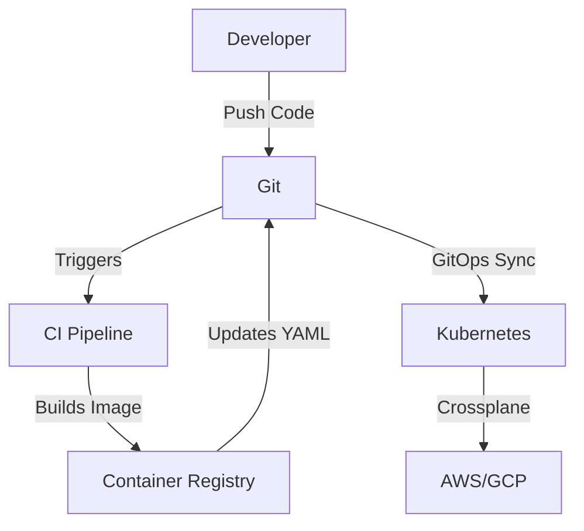

# **Comprehensive Study Material on DevOps and Internal Developer Platform (IDP)**

## **Table of Contents**
1. **Introduction to DevOps and IDP**
2. **The Actual State**
3. **The Desired State**
4. **The Tools**
5. **User Interface (UI)**
6. **Universal API (KubeAPI)**
7. **Custom Resource Definitions (CRDs) and Custom Resources (CRs)**
8. **The Process**
9. **What Do We Do in IDP?**
10. **Build vs. Buy**
11. **Today vs. Tomorrow**
12. **What To Do Next?**
13. **Examples, Diagrams, and Tables**
14. **Conclusion**

---

## **1. Introduction to DevOps and IDP**
### **What is DevOps?**
- **Misconception:** DevOps is **not** about tools like Kubernetes, AWS, Azure, Prometheus, etc.
- **Reality:** DevOps is about **enabling developers to be self-sufficient**—allowing them to deploy, monitor, and manage their applications independently.

### **What is an Internal Developer Platform (IDP)?**
- **Definition:** IDP is a **self-service platform** that abstracts operational complexity (Kubernetes, cloud, CI/CD) behind a simplified interface.
- **Purpose:** Helps developers **deploy, manage, and observe** applications without needing deep ops expertise.

**Example:**  
Instead of a developer manually writing Kubernetes YAML, the IDP provides a form where they just fill in app name, port, and CPU requirements—the platform handles the rest.

---

## **2. The Actual State**
The **actual state** refers to **what is currently running** in your system:
- **Providers:** AWS, Azure, GCP, on-prem servers.
- **Infrastructure:** Servers, clusters, databases.
- **Applications:** Your apps (microservices) or third-party apps (PostgreSQL, Redis).

**Diagram:**  
```
Actual State:
├── Providers (AWS, Azure, GCP)
│   ├── Infrastructure (Servers, Kubernetes, DBs)
│   │   ├── Applications (App1, App2, PostgreSQL)
```

---

## **3. The Desired State**
The **desired state** is **what you want your system to look like**, defined in code (YAML, JSON, Terraform).

**Problem:**  
Writing Kubernetes manifests is complex:
```yaml
apiVersion: apps/v1
kind: Deployment
metadata:
  name: my-app
spec:
  replicas: 3
  template:
    spec:
      containers:
      - name: my-app
        image: my-app:latest
        ports:
        - containerPort: 8080
```
- Developers shouldn’t need to know all these details.

**Solution:**  
Use **Custom Resource Definitions (CRDs)** to simplify definitions (more in Section 7).

---

## **4. The Tools**
### **Four Key Types of Tools for IDP:**
1. **Pipelines (CI/CD):** Jenkins, GitHub Actions, Argo Workflows.
2. **GitOps (Sync desired ↔ actual state):** Argo CD, Flux.
3. **Infrastructure as Code (IaC):** Terraform, Crossplane.
4. **Access Control (RBAC):** Kubernetes RBAC, OAuth.

**Example Workflow:**  
1. Developer pushes code → CI pipeline builds Docker image.  
2. GitOps tool (Argo CD) detects change → updates Kubernetes cluster.  
3. Crossplane provisions cloud resources (AWS RDS, S3).  

---

## **5. User Interface (UI)**
IDP should provide a **single pane of glass** (unified dashboard) for:
- **Changing desired state** (deploying apps).
- **Observing actual state** (logs, metrics).

**UI Types:**  
- **Web UI** (Backstage, Port)  
- **CLI** (`kubectl`, custom CLI)  
- **IDE Plugins** (VS Code Kubernetes extension)  

**Bad UI Example:**  
Just linking to Jenkins, Prometheus—this doesn’t simplify anything.  

**Good UI Example:**  
A form where developers input:  
- App Name  
- CPU/Memory  
- Git Repo  
- Port  

Behind the scenes, the IDP generates Kubernetes manifests.  

---

## **6. Universal API (KubeAPI)**
### **Why Kubernetes API (KubeAPI)?**
- **Universal API:** Can manage **anything** (not just containers).  
- **Reconciliation:** Ensures actual state matches desired state.  
- **Extensible:** Supports **Custom Resource Definitions (CRDs)**.  

**Example:**  
You can define a `Database` CRD:  
```yaml
apiVersion: database.example.com/v1
kind: Database
metadata:
  name: my-db
spec:
  engine: postgresql
  storage: 100Gi
```
Kubernetes reconciles this into an actual AWS RDS instance.  

---

## **7. Custom Resource Definitions (CRDs) and Custom Resources (CRs)**
### **CRD = Definition of a New Resource Type**
```yaml
apiVersion: apiextensions.k8s.io/v1
kind: CustomResourceDefinition
metadata:
  name: databases.database.example.com
spec:
  scope: Namespaced
  group: database.example.com
  versions:
    - name: v1
  names:
    kind: Database
    plural: databases
```

### **CR = Instance of a CRD**
```yaml
apiVersion: database.example.com/v1
kind: Database
metadata:
  name: my-postgres
spec:
  engine: postgresql
  version: "14"
  storage: 50Gi
```

**Why CRDs?**  
- Hide complexity (developers don’t need to know AWS/GCP specifics).  
- Standardize definitions across teams.  

---

## **8. The Process**
### **Step-by-Step Workflow:**
1. **Developer** writes code → pushes to Git.  
2. **CI Pipeline** runs tests, builds image, updates Kubernetes manifest.  
3. **GitOps (Argo CD)** detects Git change → applies to cluster.  
4. **Crossplane** provisions cloud resources (if needed).  
5. **IDP UI** shows deployment status, logs, metrics.  

**Diagram:**  
```
Developer → Git (Desired State) → Argo CD → Kubernetes (Actual State) → Crossplane → AWS/GCP
```

---

## **9. What Do We Do in IDP?**
An IDP helps with three things:
1. **Write Manifests** (via forms, CLI, IDE).  
2. **Observe Desired State** (what *should* be running).  
3. **Observe Actual State** (what *is* running, logs, metrics).  

**Example:**  
- A developer uses Backstage to deploy a new microservice.  
- The IDP auto-generates Kubernetes YAML.  
- The developer checks Grafana dashboards (via IDP) for performance.  

---

## **10. Build vs. Buy**
### **Buy (Off-the-Shelf IDP)**
- **Pros:** Fast setup (Heroku, Vercel).  
- **Cons:** Too opinionated, hard to customize.  

### **Build (Custom IDP)**
- **Pros:** Tailored to your needs.  
- **Tools:** Backstage (UI), Crossplane (CRDs), Argo CD (GitOps).  

**Decision Table:**  
| Criteria       | Buy (Heroku) | Build (Backstage + Crossplane) |
|---------------|-------------|-------------------------------|
| Speed         | ✅ Fast      | ⏳ Slower (but flexible)       |
| Customization | ❌ Limited   | ✅ Fully customizable          |
| Cost          | $$$ (SaaS)  | $$ (Open-source + DevOps time) |

---

## **11. Today vs. Tomorrow**
### **Today (2024)**
- **Tools:** Backstage, Crossplane, Argo CD, Tekton.  
- **Approach:** Build your own IDP.  

### **Tomorrow (2025+)**
- **Prediction:** Kubernetes becomes the **universal control plane** for everything (not just containers).  
- **Trend:** More companies will adopt IDPs to streamline DevOps.  

---

## **12. What To Do Next?**
1. **Explore Tools:** Try Backstage, Argo CD, Crossplane.  
2. **Start Small:** Build a simple IDP for one team.  
3. **Iterate:** Gradually add more features (RBAC, monitoring).  

---

## **13. Examples, Diagrams, and Tables**
### **Example: Simple IDP Flow**


### **Table: IDP Components**
| Component      | Example Tools         | Purpose                          |
|---------------|----------------------|----------------------------------|
| **UI**        | Backstage, Port       | Unified developer interface      |
| **CI/CD**     | Tekton, GitHub Actions| Automate builds & deployments    |
| **GitOps**    | Argo CD, Flux         | Sync Git ↔ Cluster               |
| **IaC**       | Crossplane, Terraform | Manage cloud resources           |
| **RBAC**      | Kubernetes RBAC       | Control access                   |

---

## **14. Conclusion**
- **DevOps Goal:** Empower developers to self-serve.  
- **IDP Solution:** Abstracts complexity using Kubernetes, GitOps, and CRDs.  
- **Next Steps:** Start experimenting with Backstage + Argo CD + Crossplane.  

🚀 **Key Takeaway:**  
Instead of forcing developers to learn Kubernetes, **give them a simple IDP** where they define what they need—not how it works.  

---

### **Additional Resources**
- [Backstage](https://backstage.io)  
- [Argo CD](https://argoproj.github.io/cd/)  
- [Crossplane](https://crossplane.io)  

Would you like a hands-on lab to try these concepts? Let me know! 🚀
